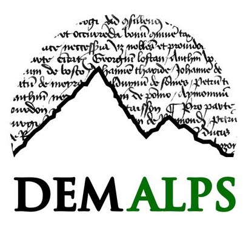

## HNR2026

The 11th International Historical Network Research Conference (HNR2026) will take place on **July 20-22, 2026** at the Università di Torino (UNITO) in Turin, Italy. It brings together researchers applying network research methods in the all historical sciences from history to archaeology, from literary studies to art history.

|       |                       |       | 
| ----------- | ----------------------------------- | -------------------- |
| <a href="cfp">**Call for Papers**</a> Call for Papers is open until December 1, 2025.  | <a href="program">**Program**</a> The keynote speaker will be <a href="https://scottbot.github.io/">Scott Weingart</a>, author of *The Network Turn* and *Exploring Big Historical Data: The Historian’s Macroscope* . | <a href="practical">**Practical information**</a> Information about the the host city and institution. | 

    

### Sponsors

&nbsp;&nbsp;&nbsp;&nbsp;&nbsp;&nbsp;   

DEMALPS and REDMIX are funded by the European Research Council (ERC)  (respectively grant numbers <a href="https://cordis.europa.eu/project/id/101077793">101077793</a> and  <a href="https://cordis.europa.eu/project/id/101124725 ">101124725 </a>)
